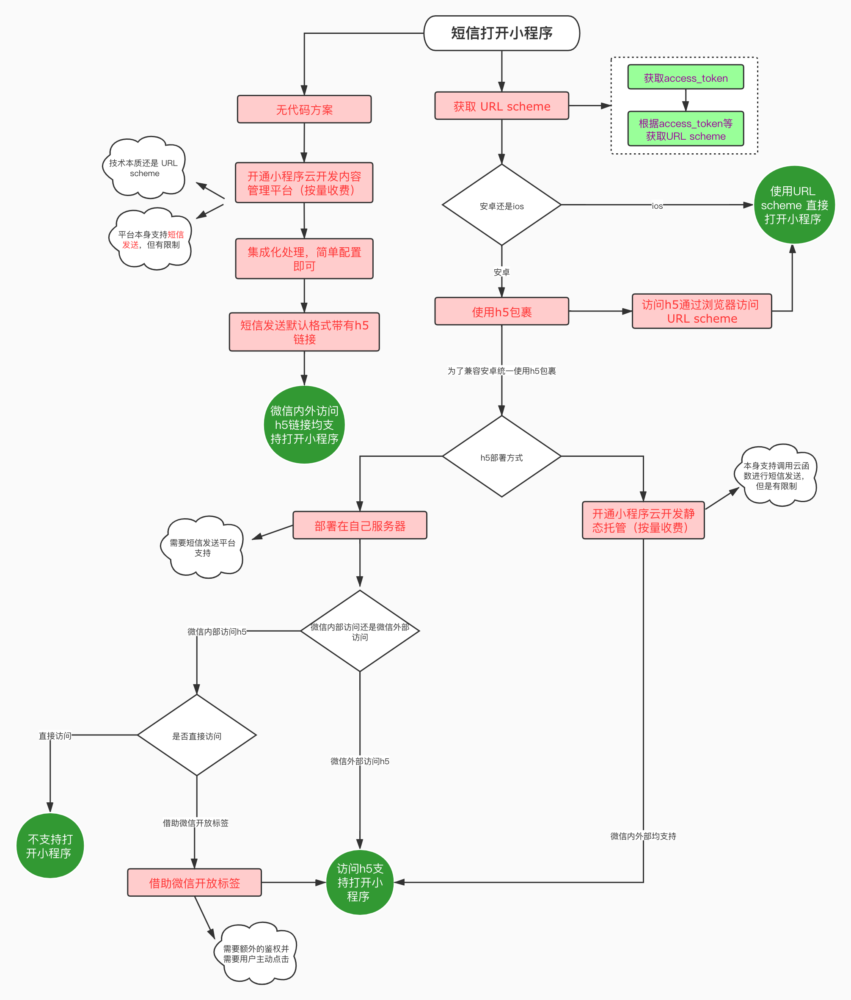

### 流程



### 技术介绍

短信打开微信小程序的本质是通过 URL scheme 协议唤醒微信从而打开小程序。

#### 1、获取access_token

`https://api.weixin.qq.com/cgi-bin/token?grant_type=client_credential&appid=APPID&secret=APPSECRET` [官方文档](https://developers.weixin.qq.com/miniprogram/dev/api-backend/open-api/access-token/auth.getAccessToken.html)


GET请求，需要以下参数

+ grant_type: 填client_credential即可。
+ appid: 小程序唯一凭证。可在「[微信公众平台](https://mp.weixin.qq.com/) - 设置 - 开发设置」页中获得。
+ secret: 小程序唯一凭证密钥，获取方式同 appid。

#### 2、生成URL scheme

`https://api.weixin.qq.com/wxa/generatescheme?access_token=ACCESS_TOKEN`  [官方文档](https://developers.weixin.qq.com/miniprogram/dev/api-backend/open-api/url-scheme/urlscheme.generate.html)

POST请求，`ACCESS_TOKEN` 是上一步中获取的，另外还需要以下参数：

```json
{
  "jump_wxa": {
    "path": "", // 跳转到对应小程序的那个页面 不填默认是首页
    "query": "" // 页面参数
  },
  "is_expire": false, // 生成的scheme码类型，到期失效：true，永久有效：false。
  // "expire_time": 1606737600, // 当为true时，设置到期时间，格式为Unix时间戳
}
```

#### 3、使用

在ios上，可以直接通过 URL scheme 打开小程序，而在Android上却不支持，因此需要额外H5页面来做兼容，使用浏览器去访问 URL sheme，本质就是:

```js
window.location.href = 'weixin://dl/business/?xxxxxx'; // URL scheme 
```

而由于技术的本质是使用 URL scheme 去唤醒微信从而打开小程序，那么在微信内部去访问 `weixin://dl/business/?xxxxx` URL scheme 是无法完成打开小程序的操作的，此时就需要在H5中引入微信开放标签，当判断是微信环境时，显示打开小程序的按钮，引导用户点击[微信开放标签打开小程序](https://developers.weixin.qq.com/doc/offiaccount/OA_Web_Apps/Wechat_Open_Tag.html)。

使用微信开放标签，需要再向后台进行单独的鉴权。并对手机系统和微信版本均有要求，微信版本要求为：7.0.12及以上。 系统版本要求为：iOS 10.3及以上、Android 5.0及以上。而且跳转到h5页面之后需要用户手动点击打开。

需要注意的是，如果我们生成的做兼容的H5页面是部署在腾讯云静态托管下的，则无需借助微信开放标签，也可在微信内部直接支持打开小程序。

#### 4、demo 介绍

+ index_src.html: 源码，搜索 `replace` 进行参数的替换。
+ qrcode.min.js: 兼容PC，如果在PC端访问，会默认生成一个二维码，并提醒用户通过移动端扫码访问。

将以上两个文件直接部署在web服务器上，就可以访问对应的URL来测试了。

其中 `weixin-demo` 目录中存放的是官方的示例Demo，也可使用该Demo，但如果部署该Demo在自己的服务器（不是腾讯云静态托管等）将失去在微信内部打开小程序的功能。